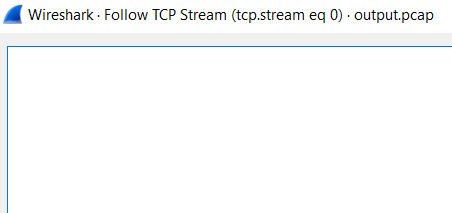
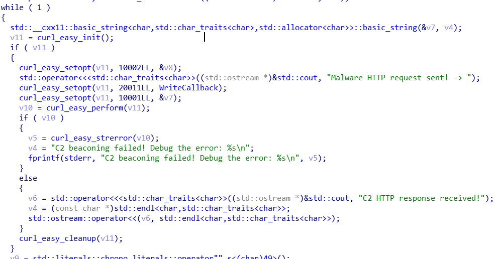

# Cyberthon: CSIT

## From 8 to 5 [1800]

_A malware was found on one of the ShoppingBaba's servers beaconing back to the cyberattackers' C2 at very regular intervals._

**Files:** [base32_example.py](https://api.csdc20f.ctf.sg/file?id=ck9f8jwm1078j0713a0kt3ikk&name=base32_example.py), [Base32.py](https://api.csdc20f.ctf.sg/file?id=ck9f8jwql078z071300d6vm1r&name=Base32.py), [from8to5_traffic_responses.zip](https://api.csdc20f.ctf.sg/file?id=ck9f8jwv7079f0713ceiedb10&name=from8to5_traffic_responses.zip), [how_to_use_SNORT.txt](https://api.csdc20f.ctf.sg/file?id=ck9f8jxk6079v0713aaqgnxqb&name=how_to_use_SNORT.txt), [malware.zip](https://api.csdc20f.ctf.sg/file?id=ck9f8jxpn07ab0713hm7020ty&name=malware.zip)

## Part 1

_Attached (zipped file of_ `from8to5_traffic_responses.txt`_) is the Base32-encoded string from each traffic packet that is the response sent by the C2 encoded using proprietary base32 encoding._

_Luckily for us, we found a message that was sent out in clear._

```
Message: 
        "ID:csit; USERNAME:S.BaBa-Server\User-Profiles; MESSAGE:Awaiting command. TIME:1583432540"
```

_First, use this knowledge and the Base32 encoder/decoder script (Base32.py and base32_example.py) to help you figure out the proprietary Base32 key used in this malware._

### Tedium

_Tedium_ is the best way to describe this part of the challenge.

Remember that `code.org` ciphertext you did in the Livestream training session? Hopefully not — code.org is a terrible place — but you'll need some of that knowledge to grok this part of the write-up.

Anyway, `from8to5_traffic_responses.txt` is a long, _long_ list of similar strings of equal length:


<center><i>If you didn't catch the hint; they're modified-base32</i></center>

Stuck in the middle of all of that is a single bit of known-plaintext: 


As from the challenge description, we must find some way to obtain the unknown base32 key to decrypt `malware.zip`. Using the plaintext as a crib, we can piece together the proprietary base32 key with an algorithm like so:

```pseudocode
def find_key(encoded, plaintext):
	key = 'ABC...XYZ<>()[]' //imperative that the inital key contains unique characters not found in the real key
	for i in the range [0, len(encoded)]:
		output = base64(plaintext, using_key=key)
		if output[i] != encoded[i]:
			index = key.index(output[i])
			key[index] = encoded[i]
	return key
draft_key = find_key('ty17zxjslyisdr1whl1wcsa5tw1szzi0rt3zcxtlhlaqcmsy0t0yhkjy0rdw6ksvnizdxiosen3cfphshl6z0ptfryjd1fozlyqb0r77lmddfxo0n3q16w1ttw1szntwe6isrniabzisa999','ID:csit; USERNAME:S.BaBa-Server\User-Profiles; MESSAGE:Awaiting command. TIME:1583432539') //this plaintext is not perfect, but is close
//further manipulations on draft_key to fix it
```

If you follow that algorithm, you'll eventually get a key looking something like `6517cyberthonl0v3paszwdqxifjkm<>`.  That will be _close_, but not quite the end. 	

For one, you'll notice that the plaintext isn't quite correct: I stole the `ty17...` above from the encoded line _directly above_ the line containing `ID:csit`, and the correct plaintext would actually have `ID:csis`:


<center><i><b>AN</b>: This doesn't actually affect anything.</i></center>

Additionally, the encoded text we chose is missing a few characters, namely `u` and `g`. Although there are smarter ways to accomplish this, I just bruteforced the last character:

```sh
for c in {a..z}
do	unzip -P 6517cyberthonl0v3paszwdqxifjkmu$c malware.zip
done
```

With that, we get the key:

#### Key: `6517cyberthonl0v3paszwdqxifjkmug`

### Part 2

_The malware is encrypted after the attack was discovered. Decrypt the malware using the base32 key found in Part 1 and connect it back to the C2._

```
- Run the malware from terminal using 
	./malware
- Enter the following webserver and port
	http://p7ju6oidw6ayykt9zeglwyxired60yct.ctf.sg:7253
```

_Write SNORT rules to help you detect the genuine C2 command (Cyberthon flag) that the C2 server will send back._

_Note: It might take a while (<5 mins) until you capture the C2 command, but if your snort did not alert you after more than 5 minutes, you might want to recheck your rules._

#### A chortle of chronology

In lieu of a proper explanation, here's a narration of what went down as the afternoon progressed:

##### Snorting at snort

I tried to deal with `snort`, and all of its eccentricities. An hour's worth of struggle with `/etc/snort/rules/local.rules`, and I was convinced enough to ditch it for lower tools.

##### Playing with pcaps

Following that, I took a gander at `tcpdump`, and tried to look through `port http` traffic to see if I could sniff out the malware's pings.

For reasons unbeknownst to me, all of the TCP streams in the trace turned up blank.



I moved on.

##### Bowling over Binaries

It then occurred to me that I should've started with the one thing I'm good at: poking at stuff with IDA Pro



<center><i>Usually</i> C++ decompilation is hell. <i>Usually</i>.</center>

Even if you don't know exactly what the output above means, it's enough to know that the binary does no special parsing of webserver url. Ergo, we can simulate `./malware` using basic command-line tools^1^.

We can run `curl` for about five minutes (as in the directive), and parse the output later on.

```sh
for i in `seq 1 300`
do	curl http://p7ju6oidw6ayykt9zeglwyxired60yct.ctf.sg:7253 >> output.curl
	sleep 1
done
```

The result will be _even more_ base32 codes:

```sh
$ cat output.curl
ty17znpdbxma6whsrwtck3hlrzmyboa1ny5b1ohsnwienioaophqbioaywrecjjblydbhkijc5bzhzfsry7zh0a7vypbhkszl6xbkuf7l5adbfi6vyqqhkp60lad1ks7l6d16m7rlyia6fosc5qbum560pzbhr7blp3d0oshbic76joshlhw1zjvhw5c0aowvzma6w1ttw1szntwe6k7b053brjs6999
ty17znpde6ma6whsrwtck3hlrzmyboa1ny5b1ohsnwienioaophqbioaywrecjjblydbhkijc5bzhzfsry7zh0a7vyp7bkszl6xbkufilmfa6m7rlyqbdr7zl5zqbr7t0n3erf7yc5sbxxoeemccxlor0waw0uswhie7hsj7hlkynfseo53whphxoynccfaovzma6w1ttw1szntwe6k7b053brks6999
... (~300 lines total)
```

If you decode all of them with the base32 key we found earlier, a few of those lines will have the flag:

```sh
$ python decode.py
ID:266; USERNAME:S.BaBa-Server\User-Profiles; MESSAGE:Cyberth0n{Check your search, this is not the flag.j6H0msSUQSoUBGIu}; TIME:1588380270
...
ID:205; USERNAME:S.BaBa-Server\User-Profiles; MESSAGE:Cyberthon{cmd:send--"/etc/passwd","/etc/shadow";op_time:0800-1700;}; TIME:1588379660
...
```

## Flag

`Cyberthon{cmd:send--"/etc/passwd","/etc/shadow";op_time:0800-1700;}`

## Footnotes

1. I am well-aware this is not the intended solution. `snort` is difficult.